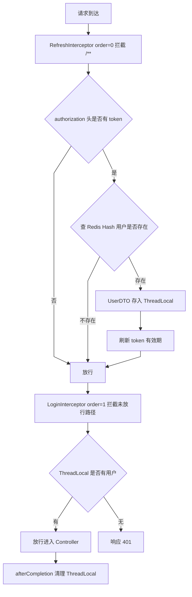

# Day34：Redis 的 Java 客户端 与 MyBatis-Plus 

---

## 一、Redis 的 Java 客户端

Redis 官方与社区提供了多种 Java 客户端，常用的有 Jedis 与 SpringDataRedis（Spring 对 Redis 客户端的封装，内置连接池与序列化机制）。

### 1. Jedis

- **线程不安全**：Jedis 实例不是线程安全的，不能多个线程共享同一个实例。
- **频繁创建销毁有性能损耗**：每次使用时都新建连接、用后即销毁，在高频访问场景下会带来较大的性能损耗。

因此，实际开发中**使用 Jedis 连接池代替 Jedis 直连**，通过连接池复用连接，避免频繁创建销毁带来的开销。

### 2. SpringDataRedis

SpringDataRedis 是 Spring 生态中对 Redis 客户端的封装，操作更简洁，且内置序列化机制。

#### 序列化

一切数据都会由**序列化器**处理之后存入 Redis。

**默认序列化器的缺点**：
- 可读性差：存入 Redis 中的数据经过 JDK 序列化，是二进制乱码，不易阅读。
- 内存占用较大：JDK 序列化产物体积较大，占用更多内存。

#### 改变序列化器

- **key 一般用 String 序列化器**（如 `StringRedisSerializer`），保证 key 可读、兼容性好；
- **value 一般用 JSON 序列化器**（如 `GenericJackson2JsonRedisSerializer`），兼顾可读性与存储体积。

---

## 二、MyBatis-Plus 知识点整理

> 本部分结合 MyBatis / MyBatis-Plus 基础用法与黑马点评（hm-dianping）项目实战整理。

### 1. MyBatis 与 MyBatis-Plus 的区别

MyBatis 是基础的 SQL 映射框架；MyBatis-Plus（简称 MP）是 MyBatis 的增强插件，官方定位是**"只做增强，不做改变"**——不改变 MyBatis 的底层机制，而是在上面提供通用 CRUD、条件构造器、分页插件等开箱即用的能力。

| 维度 | MyBatis | MyBatis-Plus |
| --- | --- | --- |
| 基本 CRUD | 手写 SQL（XML 或注解） | 继承 `BaseMapper<T>` 直接用，零 SQL |
| 单表条件查询 | 手写 where 条件 | `QueryWrapper` / `LambdaQueryWrapper` 链式拼接 |
| 分页 | 自己写 limit 或引入 PageHelper | `PaginationInnerInterceptor` + `Page<T>` |
| 主键生成 | 自己配置 | `@TableId` 支持自增、雪花 ID 等 |
| 逻辑删除 / 乐观锁 | 手写 SQL | 注解 + 插件自动处理 |
| 复杂多表 SQL | 完全支持 | 不擅长，需退回手写 SQL |

**一句话总结：单表操作无脑用 MP，多表联查、复杂 SQL 用原生 MyBatis，两者可以在同一项目中共存。**

### 2. 常用注解

#### 2.1 MyBatis 注解（写在 Mapper 接口方法上）

```java
@Select("SELECT * FROM user WHERE id = #{id}")
User selectById(@Param("id") Long id);

@Insert("INSERT INTO user(name, age) VALUES(#{name}, #{age})")
int insert(User user);

@Update("UPDATE user SET age = #{age} WHERE id = #{id}")
int updateAge(@Param("id") Long id, @Param("age") Integer age);

@Delete("DELETE FROM user WHERE id = #{id}")
int deleteById(@Param("id") Long id);
```

常用注解：`@Select`、`@Insert`、`@Update`、`@Delete`、`@Param`、`@Results` / `@Result`、`@ResultMap`、`@One` / `@Many`。

> 实际开发中复杂 SQL 更推荐写 XML，便于维护；注解适合简单 SQL。

#### 2.2 MyBatis-Plus 注解（写在实体类上）

```java
@TableName("t_user")                    // 表名与类名不一致时指定
public class User {

    @TableId(type = IdType.AUTO)        // 主键策略：AUTO 自增 / INPUT 手动输入 / ASSIGN_ID 雪花
    private Long id;

    @TableField("user_name")            // 字段名与列名不一致
    private String userName;

    @TableField(exist = false)          // 非数据库字段（联表查询结果字段）
    private String extraInfo;

    @TableField(fill = FieldFill.INSERT) // 插入时自动填充（配合 MetaObjectHandler）
    private LocalDateTime createTime;

    @TableLogic                          // 逻辑删除字段
    private Integer deleted;

    @Version                             // 乐观锁版本号
    private Integer version;
}
```

### 3. 常用用法

#### 3.1 通用 CRUD —— `BaseMapper<T>`

```java
public interface UserMapper extends BaseMapper<User> {
    // 什么也不用写，直接获得全套单表 CRUD
}

// 使用：
userMapper.selectById(1L);
userMapper.selectList(null);             // 查全部
userMapper.insert(user);
userMapper.updateById(user);
userMapper.deleteById(1L);
```

#### 3.2 条件构造器 —— Wrapper

推荐使用 Lambda 版本，编译期即可校验字段名。

```java
// 条件查询
List<User> list = userMapper.selectList(
        new LambdaQueryWrapper<User>()
                .like(User::getName, "张")
                .ge(User::getAge, 18)
                .orderByDesc(User::getAge)
);

// 条件更新
userMapper.update(null, new LambdaUpdateWrapper<User>()
        .set(User::getAge, 20)
        .eq(User::getName, "张三"));

// 聚合
Long count = userMapper.selectCount(
        new LambdaQueryWrapper<User>().gt(User::getAge, 30));
```

常用方法：`eq` / `ne`、`gt` / `ge` / `lt` / `le`、`like` / `notLike`、`in` / `notIn`、`isNull` / `isNotNull`、`between`、`orderByAsc` / `orderByDesc`、`groupBy`、`having`。

所有条件方法都有带 `boolean` 参数的重载，第一个参数为 `false` 时不拼接该条件，用于"参数为空就跳过"的场景：

```java
new LambdaQueryWrapper<User>()
        .like(StrUtil.isNotBlank(name), User::getName, name);
```

#### 3.3 条件分页查询（重点）

**前置条件：必须配置分页插件**，否则 `selectPage` 是假分页（全表查出再内存切页）。

```java
@Configuration
public class MybatisConfig {
    @Bean
    public MybatisPlusInterceptor mybatisPlusInterceptor() {
        MybatisPlusInterceptor interceptor = new MybatisPlusInterceptor();
        interceptor.addInnerInterceptor(new PaginationInnerInterceptor(DbType.MYSQL));
        return interceptor;
    }
}
```

**方式一：Service 层（推荐）**

```java
Page<Shop> page = shopService.page(
        new Page<>(current, size),
        new LambdaQueryWrapper<Shop>()
                .eq(Shop::getTypeId, typeId)
                .like(StrUtil.isNotBlank(name), Shop::getName, name)
                .ge(Shop::getScore, 4.5)
                .orderByDesc(Shop::getScore)
);
```

**方式二：Mapper 层**

```java
Page<Shop> page = shopMapper.selectPage(
        new Page<>(current, size),
        new LambdaQueryWrapper<Shop>().eq(Shop::getTypeId, typeId)
);
```

**方式三：链式调用**

```java
Page<Shop> page = shopService.query()
        .eq(Shop::getTypeId, typeId)          // LambdaQueryChainWrapper
        .like(StrUtil.isNotBlank(name), Shop::getName, name)
        .page(new Page<>(current, size));
```

`Page` 对象常用方法：

- `getRecords()` —— 当前页数据
- `getTotal()` —— 总条数
- `getPages()` —— 总页数
- `getCurrent()` / `getSize()` —— 当前页码 / 每页大小

#### 3.4 Service 层偷懒 —— `IService<T>` + `ServiceImpl<M, T>`

```java
public interface UserService extends IService<User> {}

@Service
public class UserServiceImpl extends ServiceImpl<UserMapper, User>
        implements UserService {
    // 直接用 this.list(wrapper)、this.save(user)、this.page(page, wrapper)
}
```

常用方法：`save` / `saveBatch`、`getById`、`updateById`、`removeById`、`list`、`page`、`count`、`query()`（返回 QueryChainWrapper）、`update()`（返回 UpdateChainWrapper）。

#### 3.5 自动填充 —— `MetaObjectHandler`

创建时间 / 更新时间等字段免手写：

```java
@Component
public class MyMetaObjectHandler implements MetaObjectHandler {
    @Override
    public void insertFill(MetaObject metaObject) {
        this.strictInsertFill(metaObject, "createTime", LocalDateTime.class, LocalDateTime.now());
    }

    @Override
    public void updateFill(MetaObject metaObject) {
        this.strictUpdateFill(metaObject, "updateTime", LocalDateTime.class, LocalDateTime.now());
    }
}
```

配合实体上的 `@TableField(fill = FieldFill.INSERT)` / `@TableField(fill = FieldFill.INSERT_UPDATE)`。

#### 3.6 逻辑删除 —— `@TableLogic`

```yaml
mybatis-plus:
  global-config:
    db-config:
      logic-delete-field: deleted   # 全局逻辑删除字段
      logic-delete-value: 1         # 逻辑已删除值
      logic-not-delete-value: 0     # 逻辑未删除值
```

> 注意：MP 自动生成的 SQL 会拼 `deleted = 0`，但**自己手写的 SQL 不会自动加**，需要手动处理。

#### 3.7 乐观锁 —— `@Version`

```java
@Version
private Integer version;
```

需要注册 `OptimisticLockerInnerInterceptor` 插件。更新时会带上 `version = #{version}` 条件，更新失败说明数据被并发修改过。

### 4. 黑马点评（hm-dianping）项目实战运用

#### 4.1 依赖与配置

`pom.xml`：

```xml
<dependency>
    <groupId>com.baomidou</groupId>
    <artifactId>mybatis-plus-spring-boot3-starter</artifactId>
    <version>3.5.16</version>
</dependency>
<dependency>
    <groupId>com.baomidou</groupId>
    <artifactId>mybatis-plus-jsqlparser</artifactId>
    <version>3.5.16</version>
</dependency>
```

`application.yaml`：

```yaml
mybatis-plus:
  type-aliases-package: com.hmdp.entity
```

`MybatisConfig` 注册分页插件（见上文分页配置示例，项目用的 `DbType.MYSQL`）。

#### 4.2 实体层（MP 注解）

```java
@TableName("tb_voucher")
public class Voucher implements Serializable {

    @TableId(value = "id", type = IdType.AUTO)
    private Long id;

    // 联表查出来的字段，不属于 tb_voucher 表
    @TableField(exist = false)
    private Integer stock;

    @TableField(exist = false)
    private LocalDateTime beginTime;

    @TableField(exist = false)
    private LocalDateTime endTime;
}
```

细节：`VoucherOrder` / `SeckillVoucher` 的主键用 `IdType.INPUT`，因为订单 ID 由业务层雪花算法生成，不走数据库自增。

#### 4.3 Mapper 层

10 个 Mapper 全部继承 `BaseMapper<T>`，绝大多数是空接口，例如 `UserMapper extends BaseMapper<User>`。

唯一带自定义方法的是 `VoucherMapper`（走原生 MyBatis）：

```java
public interface VoucherMapper extends BaseMapper<Voucher> {
    List<Voucher> queryVoucherOfShop(@Param("shopId") Long shopId);
}
```

#### 4.4 Service 层

10 个 Service 接口继承 `IService<T>`，实现类继承 `ServiceImpl<Mapper, T>`，例如 `ShopServiceImpl extends ServiceImpl<ShopMapper, Shop>`，无需手写单表逻辑。

#### 4.5 Controller 层（条件分页实例）

```java
// 按类型分页查店铺
Page<Shop> page = shopService.query()
        .eq("type_id", typeId)
        .page(new Page<>(current, SystemConstants.DEFAULT_PAGE_SIZE));

// 按名称模糊搜索 + 分页（条件可空）
Page<Shop> page = shopService.query()
        .like(StrUtil.isNotBlank(name), "name", name)
        .page(new Page<>(current, SystemConstants.MAX_PAGE_SIZE));

// 点赞数 +1（UpdateWrapper.setSql）
blogService.update()
        .setSql("liked = liked + 1")
        .eq("id", id)
        .update();
```

#### 4.6 项目中唯一一处原生 MyBatis

优惠券 + 秒杀券的联表查询（LEFT JOIN 超出 MP 单表能力范围），写在 `VoucherMapper.xml`：

```xml
<select id="queryVoucherOfShop" resultType="com.hmdp.entity.Voucher" parameterType="java.lang.Long">
    SELECT v.`id`, v.`shop_id`, v.`title`, ..., sv.`stock`, sv.begin_time, sv.end_time
    FROM tb_voucher v
    LEFT JOIN tb_seckill_voucher sv ON v.id = sv.voucher_id
    WHERE v.shop_id = #{shopId} AND v.status = 1
</select>
```

调用方式：`getBaseMapper().queryVoucherOfShop(shopId)` —— MP 与原生 MyBatis 通过同一个 Mapper 接口无缝融合。

### 5. 常见坑与建议

1. **MP 只适合单表**：多表 join 直接用 `@Select` 或 XML 写原生 SQL，别硬用 Wrapper。
2. **`selectList(null)` 是全表扫描**：无条件查询在生产环境要谨慎。
3. **分页必须配插件**：`MybatisPlusInterceptor` + `PaginationInnerInterceptor`，否则假分页。
4. **逻辑删除只对 MP 生成的 SQL 生效**：手写 SQL 要自己加 `deleted = 0`。
5. **字段映射**：建议实体用 `@TableField` 明确列名，避免依赖下划线转驼峰的全局配置。
6. **条件为空时用 boolean 重载**：`like(condition, column, value)`，避免拼出 `LIKE '%%'`。
7. **MP 3.5.9+ 分页需单独引入 `mybatis-plus-jsqlparser`**，否则运行时报错。

### 6. 速查口诀

- 实体：`@TableName` 对表，`@TableId` 定主键，`@TableField(exist = false)` 标虚字段
- Mapper：继承 `BaseMapper`，单表 CRUD 全免费
- Service：继承 `IService` / `ServiceImpl`，链式 `query()` / `update()` 最顺手
- 查询：条件用 `LambdaQueryWrapper`，分页用 `Page` + 插件，组合起来就是"条件分页查询"
- 复杂 SQL：XML / 注解手写，与 MP 共存不冲突


## 三、基于 Redis 的登录校验技术（hm-dianping 实战）

> 黑马点评短信登录模块采用"Redis 存 token + 双拦截器"方案：验证码、登录态全部落在 Redis，拦截器负责校验与续期，ThreadLocal 负责线程内传递当前用户。

### 1. 双拦截器判断逻辑



### 2. 核心设计要点

- **Redis key 设计**：`login:code:{phone}`（验证码，TTL 2 分钟）、`login:token:{token}`（用户 Hash，TTL 36000 分钟）
- **双拦截器职责分离**：Refresh 只做"查 Redis + 填充 + 续期"，Login 只做"判断 + 拦截"，通过 order 控制先后
- **滑动续期**：每次有效请求都会刷新 TTL，活跃用户不会掉线
- **主动下线**：删除 Redis 中的 token key 即可强制登出
- **ThreadLocal 清理**：afterCompletion 中 removeUser，防止线程池复用导致用户串号
